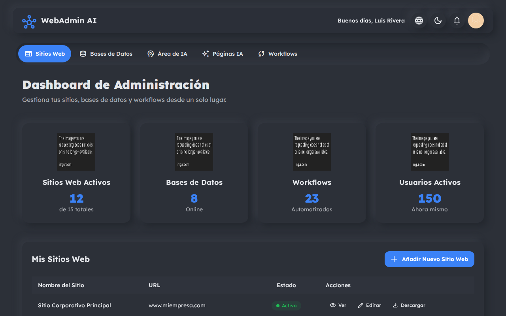
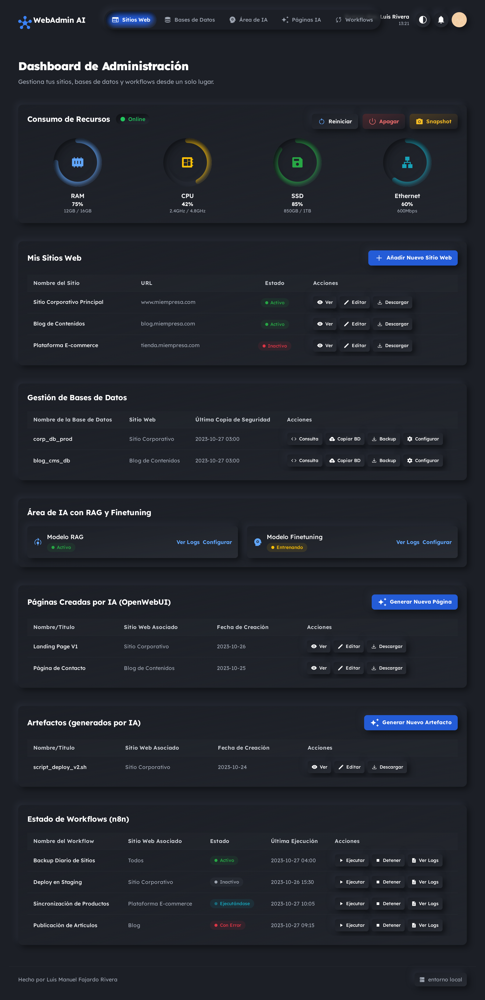

# ✨ WebAdmin AI Dashboard: Neumorphic Edition ✨

¡Bienvenido al futuro de la administración web! El **WebAdmin AI Dashboard** es una interfaz de una sola página, elegante y moderna, diseñada para simplificar la gestión de servidores, bases de datos y servicios de IA. Con un impresionante diseño **Neumórfico**, temas dinámicos y animaciones sutiles, este dashboard no solo es funcional, sino también un placer para la vista.





## 🚀 ¿Por qué te encantará este Dashboard?

Este proyecto va más allá de un simple panel de administración. Es una demostración de cómo las interfaces modernas pueden ser tanto hermosas como funcionales.

*   **🎨 Diseño Neumórfico de Vanguardia:** Una estética suave y limpia que hace que los elementos de la interfaz parezcan salir de la pantalla.
*   **🌗 Tema Dinámico (Claro y Oscuro):** Cambia entre modos de luz y oscuridad con un solo clic para adaptarse a tu entorno y preferencias.
*   **ანი Animaciones Sutiles:** Interacciones fluidas y animaciones que mejoran la experiencia de usuario sin ser intrusivas.
*   **📊 Visualización de Datos Clave:** Tarjetas de estadísticas que ofrecen una visión general instantánea de tus servicios más importantes.
*   **🌐 Soporte Multi-idioma:** Preparado para una audiencia global con soporte para inglés y español desde el primer momento.
*   **🔌 Sin Dependencias:** Un proyecto puro de HTML, CSS (Tailwind) y JavaScript que funciona directamente en tu navegador sin necesidad de instalaciones complicadas.

## 📋 Características Principales

*   **Gestión de Sitios Web:** Administra tus sitios web con opciones para añadir, editar y ver.
*   **Control de Bases de Datos:** Supervisa y gestiona tus bases de datos conectadas.
*   **Integración con IA:** Monitoriza el estado de tus modelos de IA (RAG y Finetuning).
*   **Automatización de Workflows:** Visualiza y gestiona flujos de trabajo automatizados.
*   **Y mucho más...**

## 🏁 Cómo Empezar (Getting Started)

¡Poner en marcha este dashboard es increíblemente fácil! Sigue estos sencillos pasos:

### 1. Clona el Repositorio

Abre tu terminal y clona este repositorio en tu máquina local usando el siguiente comando:

```bash
git clone https://github.com/tu-usuario/WebAdmin-AI-Dashboard.git
```

### 2. Abre el Archivo

Navega hasta el directorio del proyecto y simplemente abre el archivo `code.html` en tu navegador web preferido.

```bash
cd WebAdmin-AI-Dashboard
# Si estás en macOS
open code.html
# Si estás en Windows
start code.html
# Si estás en Linux
xdg-open code.html
```

¡Y eso es todo! No se requiere ningún servidor de desarrollo, compilación ni instalación de paquetes.

## 📄 Documentación del Código

La claridad y la mantenibilidad son clave. Por eso, todo el código JavaScript dentro de `code.html` está documentado siguiendo el estándar **JSDoc**.

*   **¿Qué significa esto?** Cada función tiene un bloque de comentarios que explica:
    *   **El propósito** de la función.
    *   **Los parámetros** que acepta (`@param`).
    *   **El valor que devuelve** (`@returns`).

Esto hace que sea increíblemente fácil de entender, modificar y ampliar el código.

```javascript
/**
 * @description Changes the language of the dashboard.
 *              This function finds all elements with the 'data-translate' attribute
 *              and replaces their text content with the translation for the selected
 *              language.
 * @param {string} lang The language code to switch to (e.g., 'es', 'en').
 * @returns {void}
 */
function changeLanguage(lang) {
    // ... código de la función
}
```

---

¡Gracias por revisar el WebAdmin AI Dashboard! Siéntete libre de contribuir, hacer un fork o simplemente inspirarte en el diseño.
